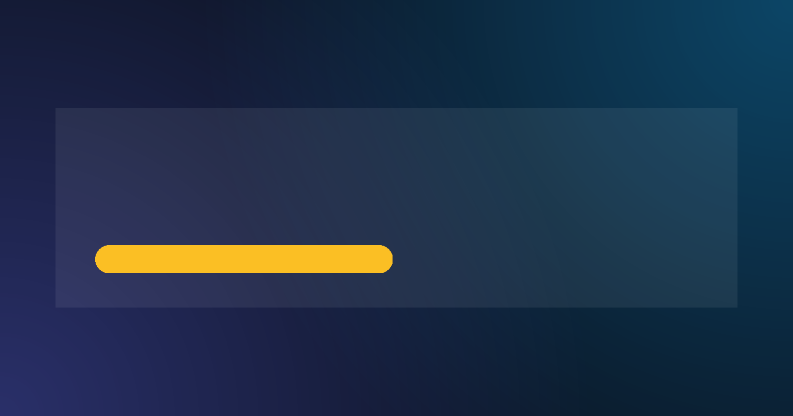

# FocusDeck — Minimal Pomodoro + Tasks

**Live Demo:** https://enesmyildiz.github.io/focusdeck/  
**Repo:** https://github.com/enesmyildiz/focusdeck




FocusDeck is a distraction‑free **Pomodoro timer** with a lightweight **task list**. It runs fully **offline** (localStorage) and is deployable as a **static site** on GitHub Pages.

## ✨ Features
- **Pomodoro cycles:** default 25/5, long break every 4 (configurable in `app.js`).
- **Tasks:** quick add, mark done, optional tags & priority.
- **Persistence:** everything stored locally (no backend).
- **Sounds & notifications** (optional).
- **Dark mode** toggle.
- **Export / Import** tasks as JSON (optional).

## 🚀 Quick Start
1) Open `index.html` locally **or** enable GitHub Pages: Settings → Pages → `main` / `(root)`.  
2) Configure durations in `app.js` (`WORK_MIN`, `SHORT_BREAK`, `LONG_BREAK`, `LONG_EVERY`).  
3) Start/pause the timer and add tasks.

## 🧩 Task Model (example)
```js
{
  id: "t1",
  title: "Read chapter 3",
  done: false,
  priority: "med",          // low | med | high
  tags: ["study"],
  due: "2025-09-01"         // optional
}
```

## ⌨️ (Optional) Shortcuts
- **Space**: start / pause timer
- **N**: new task
- **⌘/Ctrl + K**: quick actions

> If your build doesn’t include shortcuts or export/import yet, remove the bullets above.

## 🗺️ Roadmap
- Stats & streaks, weekly report, PWA install, drag‑and‑drop reordering.

## 📝 License
MIT
